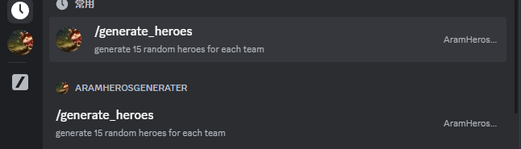

# RandomAramHerorsGenerator
This code get heros and aram tier list from OPGG and random generate 15 heros for each team in output. It is developed for playing a custom 5v5 aram game.

# Packages required
bs4  
requests  
random  
py-cord  
Any newest version should work

# Useage
For the first time using after an patch update, run tierListCrawler.py to update the newest heres and tier lists. The infomation will be stored in heres.txt  
After the heres.txt is updated, run aramList.py to generate random hero choices for each team. The result will be printed in console. You may copy and paste it to your friends.

Example output:  

# Link to your discord bot
Refer to https://boostlog.io/_junp1234/how-to-write-a-discord-bot-in-python-5a8e73aca7e5b7008ae1da8b/, make a discord bot
and add it to your server. After that, update your own discord bot token in dcBot.py. When you need the bot on, keep
dcBot.py running on you computer. Now you can use the only command /generate_heroes in the chat to get the output.

